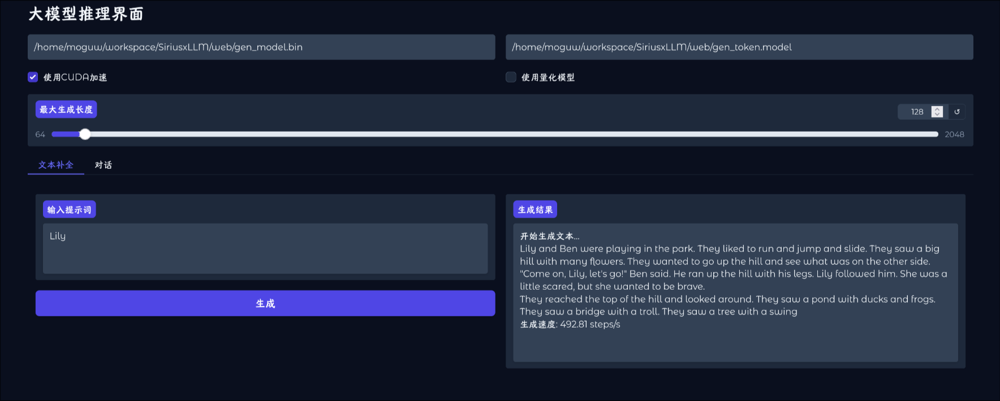
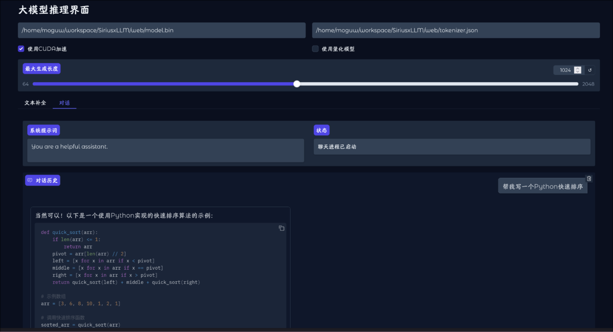

<!--
 * @Author: Morgan Woods weiyiding0@gmail.com
 * @Date: 2025-01-02 16:44:41
 * @LastEditors: Morgan Woods weiyiding0@gmail.com
 * @LastEditTime: 2025-04-01 21:06:34
 * @FilePath: /SiriusxLLM/README.md
 * @Description: 
-->
## 项目效果
文本补全

聊天机器人


## 前置要求
cmake(v3.20)、vcpkg、g++/clang++(支持C++17)、ninja

## 启动命令

```bash
vcpkg new --application
vcpkg add port xxx
vcpkg x-update-baseline --add-initial-baseline 
```


## 好用的插件
`C++ TestMate`、`koroFileHeader`
```bash
# macos
ctrl+cmd+i 快速生成头部注释
ctrl+cmd+t 快速生成函数注释
# windows
ctrl+alt+i 快速生成头部注释
ctrl+alt+t 快速生成函数注释
```
`Todo Tree`


## 注意事项
CMakeLists.txt中需要添加`set(CMAKE_TOOLCHAIN_FILE "$ENV{VCPKG_ROOT}/scripts/buildsystems/vcpkg.cmake")`

vcpkg x-update-baseline --add-initial-baseline 

CUDA需要对应的gcc版本（ArchLinux需要注意）


## 碎碎念
`include/base/alloc.h`中蕴含的设计模式思想值得学习
`vcpkg`的glog默认是**静态库**，


## NVIDIA-Docker
```bash
curl -fsSL https://nvidia.github.io/libnvidia-container/gpgkey | sudo gpg --dearmor -o /usr/share/keyrings/nvidia-container-toolkit-keyring.gpg \
  && curl -s -L https://nvidia.github.io/libnvidia-container/stable/deb/nvidia-container-toolkit.list | \
    sed 's#deb https://#deb [signed-by=/usr/share/keyrings/nvidia-container-toolkit-keyring.gpg] https://#g' | \
    sudo tee /etc/apt/sources.list.d/nvidia-container-toolkit.list
    
sudo apt-get update
sudo apt-get install -y nvidia-container-toolkit
sudo nvidia-ctk runtime configure --runtime=docker
sudo systemctl restart docker

# cuda版本小于等于自己的驱动版本
docker pull nvidia/cuda:12.3.2-cudnn9-devel-ubuntu22.04
docker run --gpus all -t -i --name kuiperllama -v "/home/moguw/workspace/kuiperllama:/kuiperllama" nvidia/cuda:12.3.2-cudnn9-devel-ubuntu22.04 /bin/bash
sed -i 's@//.*archive.ubuntu.com@//mirrors.ustc.edu.cn@g' /etc/apt/sources.list

apt update
apt install -y build-essential wget cmake git gdb clangd clang-format
apt install -y libopenblas-dev liblapack-dev libarpack2-dev libsuperlu-dev


wget https://sourceforge.net/projects/arma/files/armadillo-14.4.0.tar.xz
tar -xvf armadillo-14.4.0.tar.xz
cd armadillo-14.4.0
mkdir build && cd build
cmake -DCMAKE_BUILD_TYPE=Release ..
make -j8
make install


git clone https://github.com/google/googletest.git
cd googletest
mkdir build && cd build
cmake -DCMAKE_BUILD_TYPE=Release ..
make -j8
make install


git clone https://github.com/google/glog.git
cd glog
mkdir build && cd build
cmake -DCMAKE_BUILD_TYPE=Release -DWITH_GFLAGS=OFF -DWITH_GTEST=OFF ..
make -j8
make install


git clone https://github.com/google/sentencepiece.git
cd sentencepiece
mkdir build && cd build
cmake -DCMAKE_BUILD_TYPE=Release ..
make -j8
make install
```